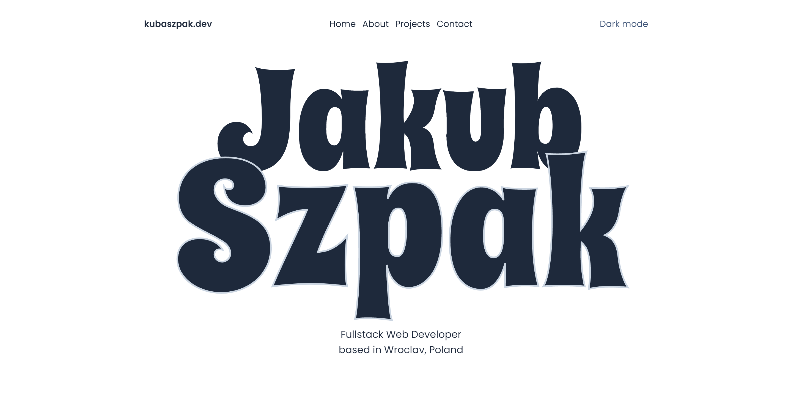

# Web portfolio

A Typescript React frontend-only website designed in Figma to represent the skills learned in programming so far. The application uses Tailwind CSS for styling with the Flowbite add-on.
 

## Link and preview

[Link](https://kubaszpak.netlify.app/)
 

